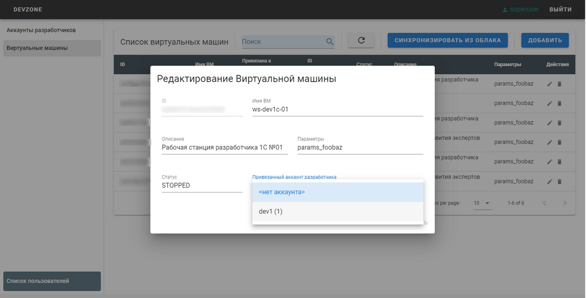
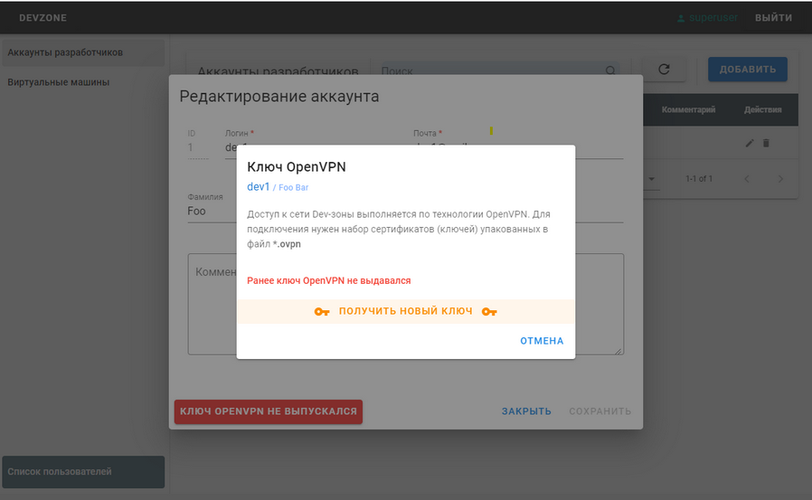

# DEV ZONE DEPLOYMENT
## Описание 
Поставляется как сервис, реализующий REST API для управление облачной зоной разработки 1С основанной на площадке Yandex.Cloud.
Для интерактивной работы пользователя доступно SPA на Vue (см. webapp)

Реализованы следующие функции:
* Ведение списка разработчиков dev-зоны
* Выпуск OpenVPN ключей 
* Ведение списка Виртуальных машин прикрепленных к разработчикам
* Интеграция с Yandex.Cloud по gRPC
* Аутентификация:
    + первичная - по логин/паролю
    + дальнейшая - по JWT-токену через cookie
* Разграничение доступа: Адмнистратор / Пользователь

## Установка
### Локальная
В ходе работы сервис будет обращаться к хранилищу ключей OpenVPN (easyrsa) для выпуска новых пользовательских ключей и сертификатов, по этому нужно либо запускать сервис от root'a или отдельной учетной записи, которой дать права на необходимые файлы. Например:
```shell
sudo adduser --no-create-home --disabled-login --gecos "" devzone
sudo apt install acl
sudo setfacl -R -m d:u:devzone:rwx /etc/openvpn/server
sudo setfacl -R -m u:devzone:rwx /etc/openvpn/server
sudo chown devzone:devzone devZoneDeployment
sudo chmod u+s devZoneDeployment
```

### Развертывание контейнера
Подготовить файл с настройками (см. ниже), указать токен к Yandex.Cloud в переменных окружения, поределить каталоги для базы данных и каталог к файлам OpenVPN. Внести изменения в compose файл и выполнить команду
```shell
docker-compose up .
```

## Настройки
Все настройки можно задать в *config.yaml*. Файл должен находиться в рабочем каталоге или уего можно зда Пример настроек **config.example.yaml**

Конфиденциальные параметры лучше задать через переменные окружения (они переопределят значения из config.yaml):
* DEVZONE_APP_SECRET - серетный ключ, используемый для генерации и валидации JWT токена
* DEVZONE_DB_PASSWORD - пароль от пользователя БД (указывается при выполнении операция с БД)
* DEVZONE_ADMIN_PASSWORD - пароль от администратора приложения (используется для аутентификации перед получением JWT)

## База данных
В качестве базы данных используется MongoDB. Там хранится информация а пользователя, разработчиках, параметрах dev-зоны и пр.
Для примера можно использовать docker образ MongoDB. Приложенный docker-compose.yaml позволяет поднять контейнеры с MongoDB и Mongo-expres (web-консоль управления СУБД)

## Примеры

